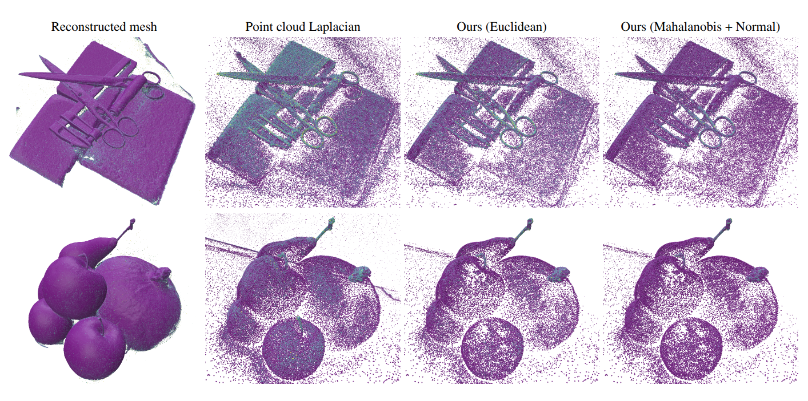

# [3DV2026]Laplace-Beltrami Operator for Gaussian Splatting
[Hongyu Zhou](zero-4869.github.io), [Zorah Lähner](https://geometryinml.cs.uni-bonn.de/team/zorah/)

**<a href="https://zero-4869.github.io/LBO4GS/" style="text-decoration: none;">Project Page</a>**|**<a href="https://arxiv.org/pdf/2502.17531" style="text-decoration: none;">Paper</a>**

*Figure 1. Curvature computed from the Laplace-Beltrami Operator using different methods*

## BibTeX
```
@inproceedings{zhou2025laplace,
  title={Laplace-Beltrami Operator for Gaussian Splatting},
  author={Zhou, Hongyu and L{\"a}hner, Zorah},
  booktitle={2026 International Conference on 3D Vision (3DV)},
  year={2026},
  organization={IEEE}
}
```

## Installation
```
git clone https://github.com/Zero-4869/3DGaussianLaplacian.git --recursive
```

To install, run 
```
cd 3DGaussianLaplacian
conda env create --file environment.yml
conda activate gaussian_laplacian

pip install torch==2.4.1 torchvision==0.19.1 torchaudio==2.4.1 --index-url https://download.pytorch.org/whl/cu121 (or other versions)

pip install submodules/diff-gaussian-rasterization
pip install submodules/simple-knn/
# tetra-nerf for triangulation
# cd submodules/tetra-triangulation
 
# Extensions
cd submodules/robust-laplacian-gs
pip install .
```

## Running
To run the demo
```
python demo.py --path <path to the .ply file>
```

## Acknowledgements
This project is built upon [Robust Laplacians](https://github.com/nmwsharp/robust-laplacians-py). The Gaussian Splatting is based on [PGSR](https://github.com/zju3dv/PGSR) and [GOF](https://github.com/autonomousvision/gaussian-opacity-fields). We thank all the authors for their great work and repos.